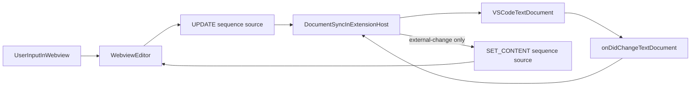

<!-- Last updated by AI: 2026-02-23 -->

# pangolin/vscode

VS Code extension. Bundled with esbuild, tested with `@vscode/test-cli`. To use VS Code GUI debugger tools, this extension must support being opened as its own workspace i.e. `cd pangolin/vscode` then `code .`

## Architecture

- `src/extension.ts` – entry point (`activate`/`deactivate`); sets `workbench.editorAssociations` on startup so `.md` defaults to the custom editor while respecting user overrides, and keeps diff/source-control markdown views on the built-in text editor
- `package.json` – uses `priority: "option"` with `onStartupFinished` so user overrides to `editorAssociations` do not activate the extension on every `.md` open
- `src/markdownEditorProvider.ts` – `CustomTextEditorProvider` for `.md`; provider wiring + webview bootstrap only
- `src/documentSync.ts` – sync coordinator for markdown document <-> webview state (debounced write-back, save-time flush, echo suppression, sequence guards, and source-aware message handling)
- `src/messageProtocol.ts` – typed host/webview protocol with source tags and monotonic sequence utilities
- `src/markdown.ts` – unified-based markdown <-> HTML conversion; `remarkTightLists` enforces tight lists, and `extractHtmlComments`/`restoreHtmlComments` preserve leading `<!-- -->` comments that Tiptap drops
- `src/images.ts` – rewrites relative image paths to webview-safe URIs and restores them on write-back
- `src/webview/editor.ts` – Tiptap editor running in the webview; link `href` is stored in `data-href` to avoid built-in interception, `Code.extend({ excludes: "" })` allows code + link marks together, and `SET_CONTENT` selection restore is guarded to avoid undo/redo cursor jumps
- `src/webview/find.ts` – find-in-editor behavior (plugin, keybinding, DOM bindings)
- `node_modules/@types/vscode/index.d.ts` – Full VS Code API typings

### Sync control pattern

Ownership boundaries:

- Webview owns editor UI state and local interaction intent
- Extension host owns persisted markdown state and sync arbitration
- Typed protocol defines message shape and provenance (`source`); runtime guards in host/webview enforce ordering (`sequence`)

Sync invariants:

- `sequence` values are strictly increasing positive integers on both channels; stale or invalid values are ignored
- Canonical markdown equivalence (`\r\n` normalization + `trimEnd`) is the primary echo-suppression gate
- `expectedApplyMarkdownCanonicals` is a bounded queue of expected applyEdit canonicals; matching entries are consumed during `onDidChangeTextDocument` echo suppression
- Save-time flushes set `expectedSaveMarkdownFromWebview` so immediate post-save document echoes are ignored
- Redundant external `SET_CONTENT` is blocked when computed HTML already matches `webviewHtml` to preserve undo history

Current caveats:

- Undo/redo keybindings are overridden via `package.json` `contributes.keybindings` when `activeCustomEditorId` matches our editor; this prevents VS Code's document-level undo from racing with Tiptap's ProseMirror History on Ctrl+Z and routes undo/redo through the webview as the single source of truth
- `DocumentSync.handleWebviewMessage` uses `htmlToMarkdownSync` on each `UPDATE` to keep canonical baseline fresh; this improves race handling but can add extension-host CPU pressure during rapid typing/undo bursts

### Markdown

The editor targets [GFM (GitHub Flavored Markdown)](https://github.github.com/gfm/). Both sides of the pipeline – Tiptap (webview) and unified (Node) – must support a feature for it to round-trip.

| GFM feature      | Tiptap extension                        | unified plugin         |
| ---------------- | --------------------------------------- | ---------------------- |
| Headings         | StarterKit                              | remark-parse/stringify |
| Bold             | StarterKit                              | remark-parse/stringify |
| Italic           | StarterKit                              | remark-parse/stringify |
| Strikethrough    | StarterKit (Strike)                     | remark-gfm             |
| Inline code      | @tiptap/extension-code                  | remark-parse/stringify |
| Code blocks      | StarterKit                              | remark-parse/stringify |
| Blockquotes      | StarterKit                              | remark-parse/stringify |
| Bullet lists     | StarterKit                              | remark-parse/stringify |
| Ordered lists    | StarterKit                              | remark-parse/stringify |
| Task lists       | @tiptap/extension-task-list + task-item | remark-gfm             |
| Links            | @tiptap/extension-link                  | remark-parse/stringify |
| Autolinks        | @tiptap/extension-link (autolink)       | remark-gfm             |
| Images           | @tiptap/extension-image                 | remark-parse/stringify |
| Tables           | @tiptap/extension-table                 | remark-gfm             |
| Horizontal rules | StarterKit                              | remark-parse/stringify |
| Hard breaks      | StarterKit                              | remark-parse/stringify |

Markdown normalization invariants:

- `remarkNormalizeInlineMarks` is the single normalization pass for inline mark stability; no post-string entity rewrites should be needed
- Adjacent same-type marks (`emphasis`, `strong`, `delete`) are merged and same-type nested marks are flattened
- Split-mark islands generated by editor HTML are normalized before stringify (for example fragmented emphasis around link/strong runs)
- Normalization is semantic-preserving and idempotent; running it multiple times should not further change mdast
- `remarkTightLists` always forces tight list output (`spread: false`) for both list and listItem nodes

## Build

Three outputs must all be compiled for the extension to work:

| Output                    | Source                   | Tool                   |
| ------------------------- | ------------------------ | ---------------------- |
| `dist/extension.cjs`      | `src/extension.ts`       | esbuild (Node CJS)     |
| `dist/webview/editor.js`  | `src/webview/editor.ts`  | esbuild (browser IIFE) |
| `dist/webview/editor.css` | `src/webview/editor.css` | Tailwind CSS CLI       |

`pnpm compile` produces all three. `pnpm package` does the same with minification.

`tsconfig.json` includes `DOM` in `lib` because Tiptap's types require it. Gotcha: DOM globals (e.g. `document`, `window`) will type-check everywhere but only exist at runtime in `src/webview/`.

## Debugging

Press `F5` to launch an Extension Development Host. The default build task starts three watchers in parallel: `watch:esbuild` (both TS outputs), `watch:css` (Tailwind), and `watch:tsc` (type-check only, no output).

## Testing

- `pnpm test` runs `vscode-test`, which launches an Extension Development Host (real VS Code/Electron)
- In agent/non-interactive workflows, DO NOT run `pnpm test` as a default validation step; use `pnpm lint` and `pnpm check:types` instead
- Use `pnpm test` only when a GUI-backed extension test run is explicitly needed/available

## Packaging and publishing

All packaging and publishing scripts use `--no-dependencies` because `npm list` can't resolve pnpm's symlinked `node_modules`; all production dependencies are already bundled by esbuild.

- **VS Code Marketplace:** `pnpm vsce:package` to produce a `.vsix`, `pnpm vsce:publish` to publish (requires `VSCE_PAT`). See [Publishing Extensions](https://code.visualstudio.com/api/working-with-extensions/publishing-extension).
- **Open VSX:** `pnpm ovsx:package` to produce a `.vsix`, `pnpm ovsx:publish` to publish (requires `OPENVSX_TOKEN`). See [Publishing Extensions (Open VSX)](https://github.com/eclipse/openvsx/wiki/Publishing-Extensions).

The `publish-pangolin-vscode.yml` GitHub Action publishes to both marketplaces automatically on `pangolin/vscode@*` tag push.

Cursor sources extensions from Open VSX and applies its own verification/indexing, so availability in Cursor can lag briefly after Open VSX publish. See [Cursor extension docs](https://cursor.com/docs/configuration/extensions).

## Key dependencies

### Tiptap

To learn more, [read the Tiptap docs](https://tiptap.dev/docs).
